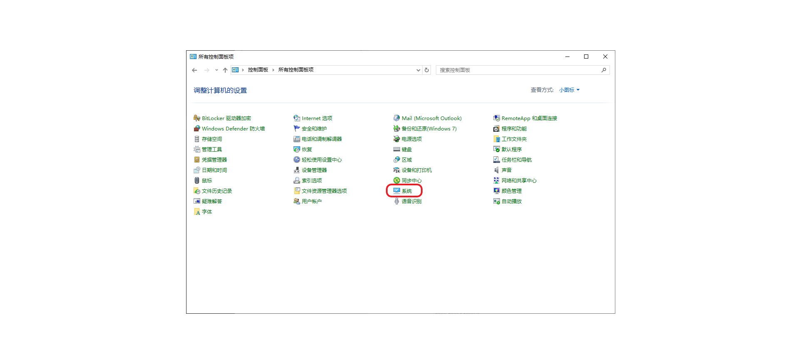
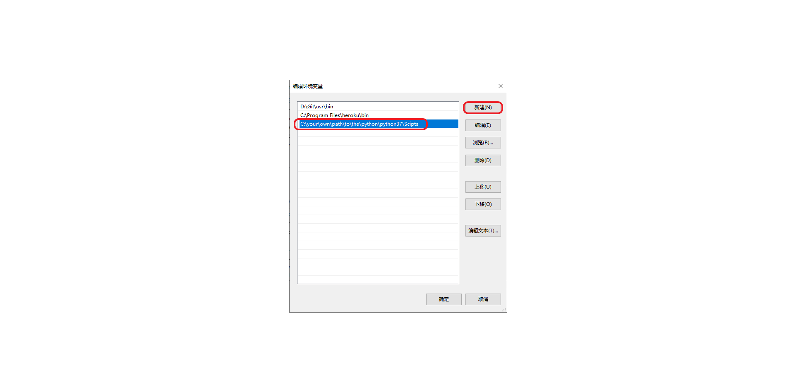

# How to Build Your Own Wiki Page

## Previewing Your Markdown Page

We recommend using the same engine as the site — **MkDocs** — so you can preview and develop your pages locally.

### For Windows:

**1. Open PowerShell and run:**

```bash
pip install mkdocs
```

**2. Check the installation location:**

```bash
pip show mkdocs
```

You’ll see something like:

```text linenums="1" hl_lines="8"
Name: mkdocs
Version: 1.5.3
Summary: Project documentation with Markdown.
Home-page:
Author:
Author-email: Tom Christie <tom@tomchristie.com>
License:
Location: c:\your\own\path\to\the\python\python37\site-packages
Requires: click, colorama, ghp-import, importlib-metadata, jinja2, markdown, markupsafe, mergedeep, packaging, pathspec, platformdirs, pyyaml, pyyaml-env-tag, typing-extensions, watchdog
Required-by: mkdocs-material
```

So the executable script will be located at:

```text
Location: C:\your\own\path\to\the\python\python37\Scripts\mkdocs.exe
```

**3. Add the script directory to your system `PATH`:**

> Please follow the steps below.

**3.1 Open the Control Panel and click "System":**  
{ width="95%" }

**3.2 Click "System settings" on the right:**  
{ width="95%" }

**3.3 Click "Advanced system settings" and then the "Environment Variables" button:**  
{ width="95%" }

**3.4 Under "User variables", click "Edit":**  
{ width="95%" }

**3.5 Click "New", then paste the path where `mkdocs.exe` is located (ending with `Scripts`):**

```text
C:\your\own\path\to\the\python\python37\Scripts
```

{ width="95%" }

**4. Create a folder for it and run:**

```bash
mkdocs serve
```

Now you can check your own markdown file or the whole page locally.
